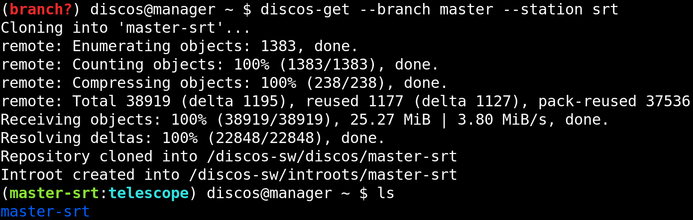
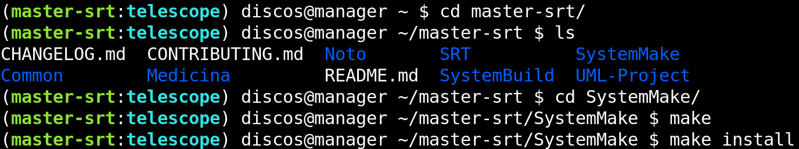

.. _deploy_development:

***********
Development
***********

Machines deployment
===================
In the :ref:`deploy_quickstart` section we have seen how to deploy a
``manager`` virtual machine. The development system is currently made
of only the ``manager`` virtual machine. In the future some machines could
be added to the deployment procedure. To deploy all of them, it is sufficient
to pass to the ``discos-deploy`` script the ``discos`` *cluster* instead of
a single machine name, the ``discos`` keyword always identify the whole
environment, so it will install all the machines found in the correspondent
Ansible inventory.

.. code-block:: shell

  $ discos-deploy discos:development

This command will connect via SSH to all development machines and provision the
whole system (create users, configure networking, install yum packages,
configure NIS, Lustre, ACS and its dependencies, install some utilities, and
finally the DISCOS dependencies).

Working without Vagrant
-----------------------
If you wish to deploy a development environment on physical machines, or you
simply want to install the virtual machines by yourself using VirtualBox or
another virtual machine provider, you can still use the ``discos-deploy``
script to perform the automatic deployment procedure. You first have to setup
the machines' network interfaces, in order to enable Ansible access to them via
the correct IP address, and then start the deployment procedure by passing the
``--no-vagrant``, ``-n`` flag to the ``discos-deploy`` script:

.. code-block:: shell

   $ discos-deploy manager:development --no-vagrant

This will let the script know that you do not want to create any (other)
virtual machine on your system, and that you want to apply the whole
configuration onto an existing, physical or virtual, set of machines.

DISCOS setup
============

Manual setup
------------
To download the DISCOS control software, you can use the ``discos-get`` command,
covered in the :ref:`get_a_discos_branch` section.

Once the download of the repository is completed, you have to perform the setup
procedure like we have seen in the :ref:`install_discos` section.

Automatic setup
---------------
You can let the deployment procedure perform the DISCOS control system setup
for you by specifying the ``--branch`` argument to the ``discos-deploy``
script, followed by the branch name you want to deploy and install. Since the
procedure will internally call the ``discos-get`` script for you, if you are
deploying in a development environment, you also have to provide to the script
the ``--station`` argument, followed by the name of the desired station.

.. code-block:: shell

  $ discos-deploy discos:development --tag discos1.0-rc02 --station noto

You can choose a station among ``medicina``, ``noto`` and ``srt``.
The ``discos-get`` command gets executed on all machines of the system at the
same time.
