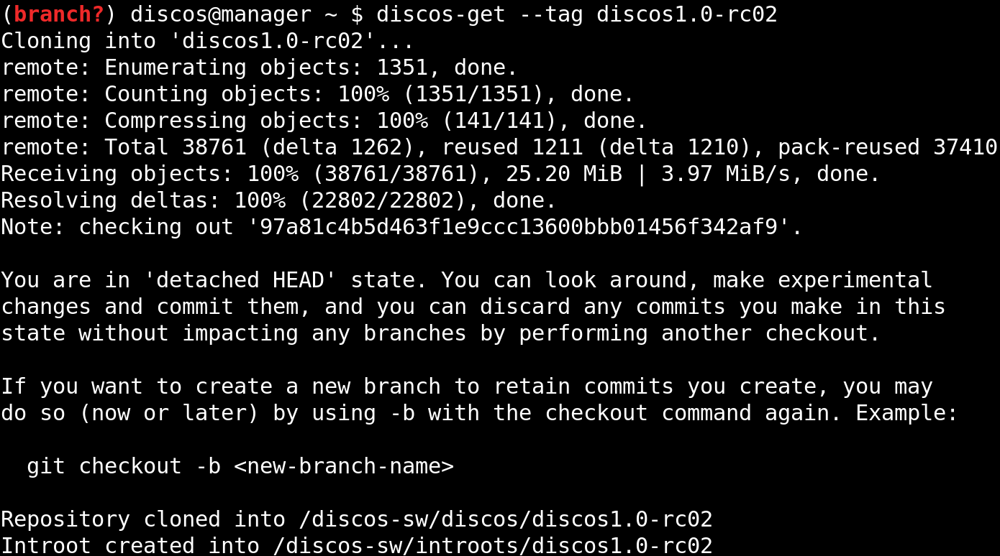

.. _deploy_production:

**********
Production
**********

Machines deployment
===================
To deploy the system in production, you have to specify a *cluster* of machines,
followed by the name of the station, you can choose among ``medicina``,
``noto`` or ``srt``:

.. code-block:: shell

  $ discos-deploy discos:srt

As mentioned in the :ref:`deploy_development` section, the ``discos`` *cluster*
makes the automatic procedure provision the whole DISCOS system, composed by
all the required station machines. If you only want to deploy a single machine,
change the cluster from ``discos`` to the related machine name. For instance,
in the following case we are deploying only the ``console`` machine for the
``srt`` station:

.. code-block:: shell

  $ discos-deploy console:srt

DISCOS setup
============

Manual setup
------------
To install the DISCOS control software, you can use the ``discos-get`` command
and then build and install the system by yourself, as we already saw in the
:ref:`get_a_discos_branch` paragraph. Since this time we are deploying in a
production environment, you may want to deploy a DISCOS tag. The ``discos-get``
script can handle this case just like it does for normal branches. All you have
to do is pass to the scripts command line the ``--tag`` argument instead of the
``--branch`` one. Of course, you also have to specify the desired DISCOS tag
afterwards:

The downloaded tag will be handled by ``discos-get`` and ``discos-set`` just
like a normal branch.

.. note:: As you may have noticed from the last image, the downloaded
   repository will be left in a ``detached HEAD' state``. This means that any
   modification you make to the repository will not be tracked by any remote
   branch. If you want to edit some files in order to push a hotfix you should
   download and work on the ``stable`` branch.

You can now build and install the DISCOS control system as we already saw in
the :ref:`install_discos` paragraph.

Automatic setup
---------------
The ``discos-deploy`` script can automatically handle the DISCOS setup
procedure even for tags. In order for it to do this, you have to pass the
``--tag`` argument to the ``discos-deploy`` command, followed by the DISCOS
tag you want to install on the machines:

.. code-block:: shell

   $ discos-deploy discos:srt --tag discos1.0-rc02

.. note:: Since you are performing the deployment procedure on station
   machines, the station name is already specified inside the machines
   themselves as an environment variable, so you can omit the ``--station``
   argument from both the ``discos-deploy`` and ``discos-get`` scripts. If you
   pass the ``--station`` argument anyway, if the given argument does not match
   the correct station you will receive an error and the procedure will stop.
