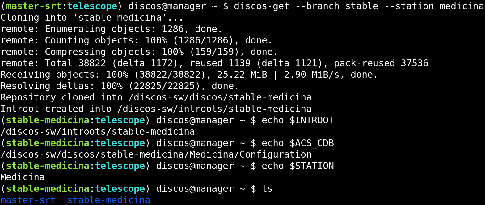

.. _deploy_quickstart:

***********
Quick start
***********

If you have installed the dependencies, as explained in section
:ref:`dependencies`, then you are ready to download the
`DISCOS deployment repository <https://github.com/discos/deployment.git>`_
and install it:

.. code-block:: shell

   $ git clone https://github.com/discos/deployment.git
   Cloning into 'deployment'...
   $ cd deployment
   $ python setup.py
   Would you like to automatically install the requirements? [Y/n]:
   Installing 'pexpect' package...done.
   Would you like to add the scripts to your ~/.bashrc file? [Y/n]:
   The file that sources the scripts has been added to your ~/.bashrc file.
   They will be available as soon as you open a new terminal. Have fun!

As you may have noticed from the above command output, the ``setup.py`` script
can handle the python required packages setup procedure automatically. It can
also add some useful scripts by sourcing them via your .bashrc file.
You can read additional information about these scripts in the section
:ref:`deploy_scripts`.

.. note:: You can decide not to add the provided scripts to your .bashrc file,
   but you can still execute them directly from the ``scripts`` directory
   inside the repository directory.

Provision the system
====================
The provisioning procedure is entirely handled by the :file:`discos-deploy`
script, that we installed in the previous step. Below you can find an
explanation of how the script works, along with some command line examples that
show you how to deploy the environment you want. For instance, the following
command will create the ``manager`` virtual machine, and will install all
dependencies and configuration files on it:

.. code-block:: shell

   $ discos-deploy manager:development

In this case we gave the :file:`discos-deploy` script the
``manager:development`` argument.  It means we want to deploy only the
``manager`` machine, in the ``development`` environment.  We will see more
about the environments in sections :ref:`deploy_development` and
:ref:`deploy_production`.

The deployment of a single machine can take between 30 minutes and one hour,
depending of your machine, because it has to download and install the operating
system, all the dependencies (ACS, DISCOS libraries, etc.), create users and
groups, configure the network, and create a complete working environment, as we
will see in a few moments.

.. note:: You can run the deployment more than once, because the process is
   idempotent, that is, the result of performing the deployment once is
   exactly the same as the result of performing it repeatedly without any
   intervening actions. In fact, if you run the deployment process once again,
   it will take just a few minutes.

When the deployment procedure is complete, we will have the ``manager``
virtual machine deployed with everything we need.

.. _get_a_discos_branch:

Get a DISCOS branch
===================
Login via SSH to ``manager`` machine (or use the :file:`discos-login` script
described in the :ref:`deploy_scripts` section):

.. code-block:: shell

    $ ssh discos@<manager IP address>
    (branch?) discos@manager ~ $

Currently we have no active branch, that is why there is the ``(branch?)`` text
at the beginning of the prompt. To get a DISCOS branch and activate it, we have
to use the ``discos-get`` command. In the following case we get the ``master``
branch for the ``SRT`` station:

.. figure:: images/discos-get.png
   :figwidth: 100%
   :align: center

Note that this is not a *code-block*, but a screenshot of the shell.
As you can see the environment shows the prompt using a syntax highlight. The
``branch?`` text has been replaced by ``master-srt:telescope``, because we are
working on the branch ``master``, using its ``telescope`` CDB, which is the
actual production CDB, hosted into ``SRT/Configuration``. The ``INTROOT`` has
been created outside the ``discos`` user home directory, in order to enable
access to it to a generic ``observer`` user, and it shares the same name as the
downloaded branch. Also, you may have noticed that the ``discos-get`` command
accepts a ``--station`` argument. This argument is required on development
machines, since they are generic and do not completely reflect the behavior of
a production machine. In case of production machines, the ``--station``
argument is disabled since the station is already specified by the system
itself. This was made in order to avoid using a different station configuration
database. Here is the current environment:

.. figure:: images/environment.png
   :figwidth: 100%
   :align: center

Change the CDB
==============
The ``discos-set`` command allows us to specifying the CDB.
We can choose either ``--cdb telescope`` or ``--cdb test``:

.. figure:: images/cdb.png
   :figwidth: 100%
   :align: center

Change the active branch
========================
Sometime we want to have more than one branch and switch between them.
For instance, let's get the ``stable`` branch for ``Medicina`` station:

Now we have two branches, ``master-srt`` and ``stable-medicina``, and the
latter is the active one. We can switch back to the ``master`` branch using the
``discos-set`` command:

.. figure:: images/discos-set.png
   :figwidth: 100%
   :align: center

Remove a branch
===============
To remove a branch, just remove the directory:

.. figure:: images/remove-branch.png
   :figwidth: 100%
   :align: center

The related ``INTROOT`` will be deleted automatically right after the branch
directory is removed.

.. _install_discos:

Install DISCOS
==============
To install the DISCOS control system, execute the commands shown in the image
below:

.. figure:: images/make.png
   :figwidth: 100%
   :align: center

.. note:: The output of the ``make`` and ``make install`` commands shown above
   was suppressed. The whole building and installation process can take up to
   one hour or more, depending on your system.

What we have seen so far is enough for deploying a small development
environment, but there is more to know.  Maybe you want to deploy the whole
system, composed of several VMs, or maybe you want to deploy the system on
production machines. For more information about these topics have a look at
the :ref:`deploy_development` and :ref:`deploy_production` sections. You will
realize that everything is as easy as we saw here, and for deploying in
production is even easier.
