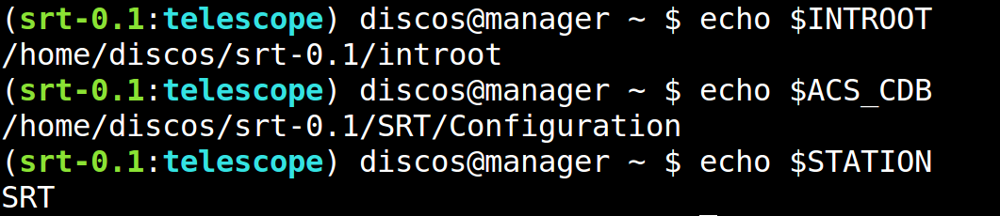
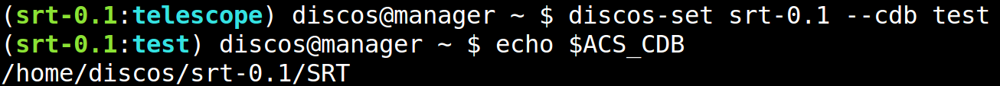
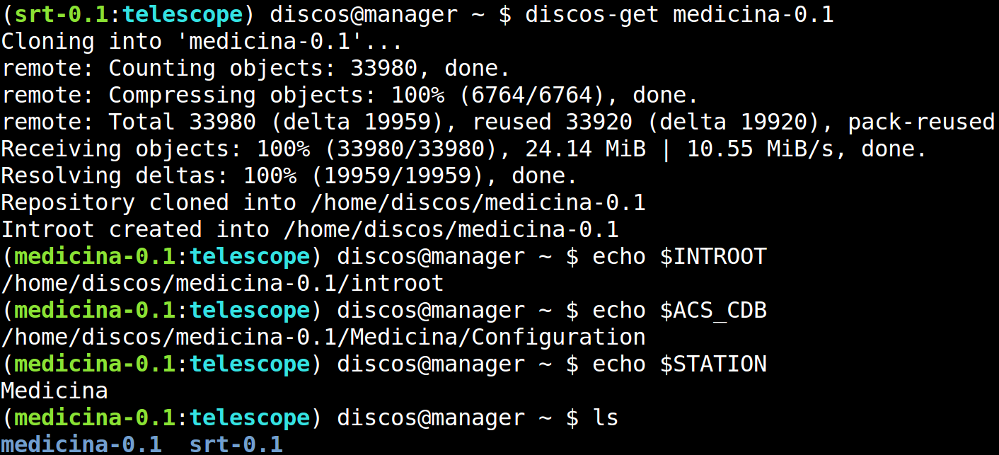
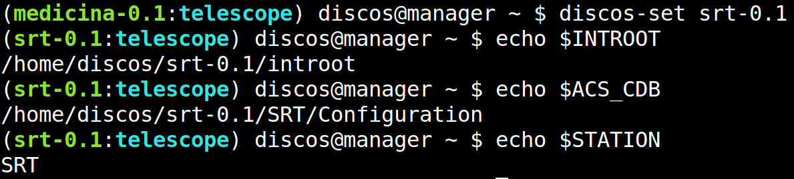
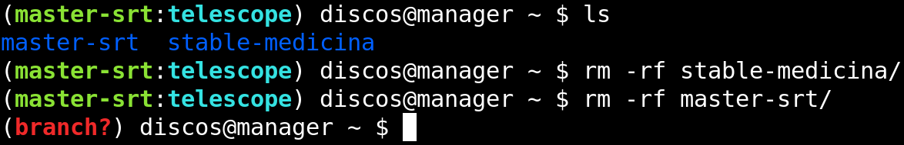
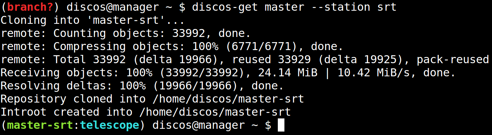

.. _deploy_quickstart:

***********
Quick start
***********

If you have installed the four dependencies, as explained in
section :ref:`dependencies`, then you are ready to download the
`DISCOS deployment repository <https://github.com/discos/deployment.git>`_
and move on it:

.. code-block:: shell

   $ git clone https://github.com/discos/deployment.git
   Cloning into 'deployment'...
   $ cd deployment

Provision the system
====================
To provision the whole system you just have to execute the :file:`build` script.
That is all. For instance, the following command will create the
``manager`` virtual machine, and will install all
dependencies and configuration files on it:

.. code-block:: shell

   $ ./build manager:development

In this case we give the :file:`build` script the ``manager:development``
argument.  It means we want to deploy only the ``manager``, in the
``development`` environment.  We will see more about the environments in
sections :ref:`deploy_development` and :ref:`deploy_production`.

The deployment will take between 30 minutes and one hour, depending of your
machine, because it has to download and install the operating system, all
dependencies (ACS, DISCOS libraries, etc.), create users and groups, configure
the network, and create a complete working environment, as we will see in a moment.

.. note:: You can run the deployment more than once, because the process is
   idempotent, that is, the result of performing the deployment once is
   exactly the same as the result of performing it repeatedly without any
   intervening actions.  In fact, if you run the deployment process once again,
   it will take just a few minutes.

When the deployment is done, we will have the ``manager``
virtual machine delpoyed with everything we need.

Get a DISCOS branch
===================
Login via SSH to the ``manager``:

.. code-block:: shell

    $ ssh discos@192.168.10.200
    (branch?) discos@manager ~ $

Currently we have no branch active, that is why there is the ``(branch?)`` text
at the beginning of the prompt.  To get a DISCOS branch and activate it, we have to
use the ``discos-get`` command.  In the following case we get the ``srt-0.1`` branch:

.. figure:: images/discos-get.png
   :figwidth: 100%
   :align: center

Note that this is not a *code-block*, but a screenshot of the shell.  As
you can see, the environment shows the prompt using a syntax highlight.
The ``branch?`` text has been replaced by ``srt-0.1:telescope``, because we
are working on the branch ``srt-0.1``, using its ``telescope`` CDB, that is
the real CDB, hosted in ``SRT/Configuration``.
The ``INTROOT`` has been created inside the ``srt-0.1`` directory.  Here is the
current environment:

Change the CDB
==============
The ``discos-set`` command allows us to specifying the CDB.
We can choose either ``--cdb telescope`` or ``--cdb test``:

Change the active branch
========================
Sometime we want to have more than one branch and switch between them.
For instance, let's get the ``medicina-0.1`` branch:

Now we have two branches, ``srt-0.1`` and ``medicina-0.1``, and the latter is
the active one.  We can switch to the ``srt-0.1`` branch using the ``discos-set``
command:

Remove a branch
===============
To remove a branch, just remove the directory:

Get the master branch
=====================
If you want to get a master branch, you need to specify the station:

What we have seen so far is enough for deploying a small development
environment, but there is more to know.  Maybe you want to deploy the whole
system, composted of several VMs, or maybe you want to deploy the system in
production.  For more information about these topics have a look at the sections
:ref:`deploy_development` and :ref:`deploy_production`.  You will realize that
everything is as easy as we saw here, and for deploying in production is even easier.
